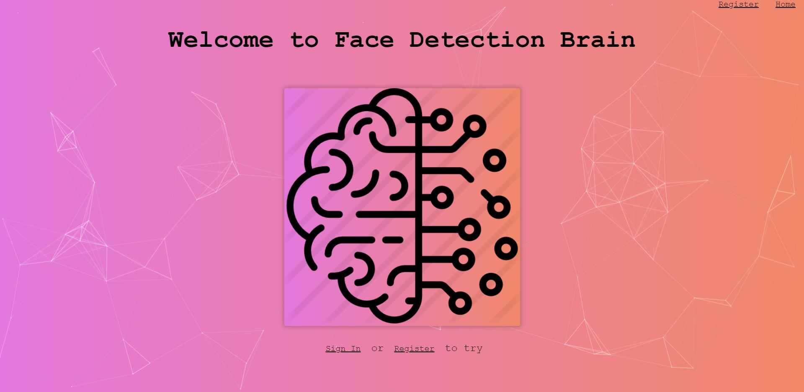
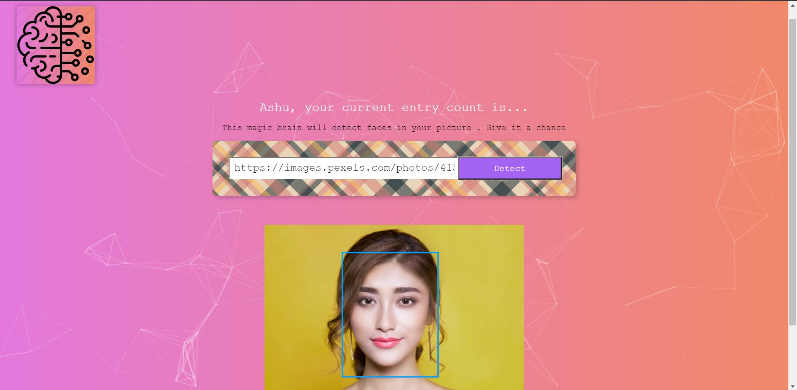

This project was bootstrapped with [Create React App](https://github.com/facebook/create-react-app).

## Run it on your local system

1. Clone the repository. 
2. Inside the facedetect-brain folder open the command line or terminal and type: `npm i` (Before this you must have npm in your device)
3. After the installation of required libraries, in the same directory type `npm start` in the command line or terminal 
4. By default it will run in prot 3000 i.e, `https://localhost:3000`

### `Landing Page of the App`

### `Detect Face`

Paste the image url (from the internet) inside the detect box then push detect button and see the magic

